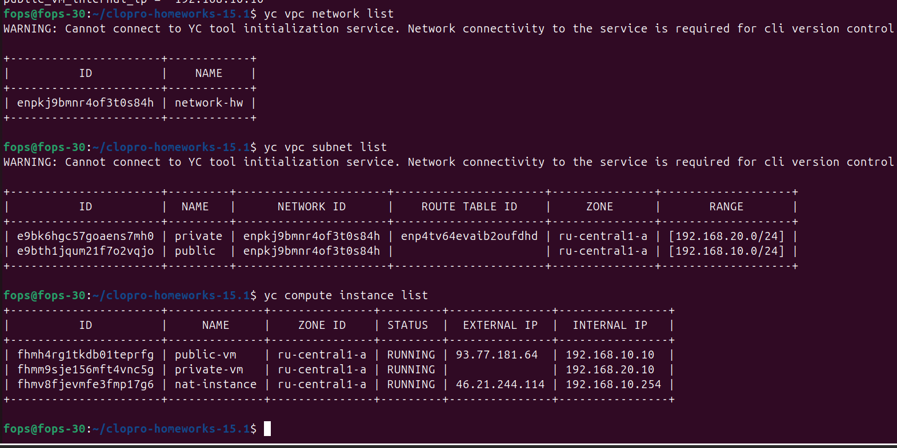
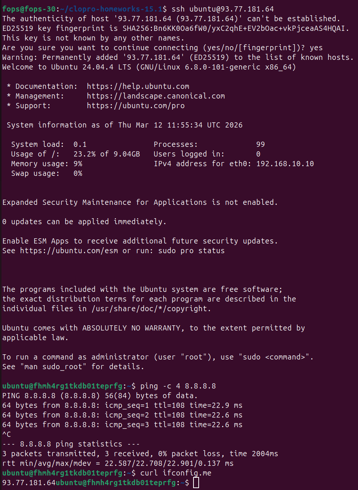

# Домашнее задание: «Организация сети»

## Цель задания
Развернуть сетевую инфраструктуру в облаке с помощью Terraform:
- в **Yandex Cloud**

---

## Используемые инструменты
- Terraform
- Yandex Cloud
- SSH

---

# Задание 1. Yandex Cloud

## Что реализовано
- создана отдельная VPC;
- создана публичная подсеть `public` `192.168.10.0/24`;
- создан NAT-инстанс с адресом `192.168.10.254`;
- создана виртуальная машина в публичной подсети с публичным IP;
- создана приватная подсеть `private` `192.168.20.0/24`;
- создана route table с маршрутом по умолчанию через NAT-инстанс;
- создана виртуальная машина в приватной подсети;
- проверен выход в интернет с публичной и приватной ВМ.

## Terraform-файлы
- `main.tf`
- `network.tf`
- `nat-instance.tf`
- `instances.tf`
- `variables.tf`
- `outputs.tf`
- `data.tf`

---

## 1. Инициализация Terraform

```bash
terraform init
```

## 2. Проверка конфигурации

```bash
terraform validate
terraform plan
```

Скриншот:


---

## 3. Применение конфигурации

```bash
terraform apply
```

Скриншот:


---

## 4. Проверка созданных ресурсов

```bash
yc vpc network list
yc vpc subnet list
yc compute instance list
```

Скриншот:



---

## 5. Проверка доступа в интернет с публичной ВМ

Подключение:

```bash
ssh <user>@<public_ip>
```

Проверка:

```bash
ping -c 4 8.8.8.8
curl ifconfig.me
```

Скриншот:



---

## 6. Подключение к приватной ВМ через публичную

С публичной ВМ:

```bash
ssh <user>@192.168.20.x
```

Проверка на приватной ВМ:

```bash
ping -c 4 8.8.8.8
curl ifconfig.me
ip route
```

Скриншот:


---

## Вывод по Yandex Cloud

В Yandex Cloud была развернута сеть с двумя подсетями:
- публичная подсеть с NAT-инстансом и внешней ВМ;
- приватная подсеть с маршрутизацией исходящего трафика через NAT-инстанс.

Проверка показала:
- у публичной ВМ есть прямой доступ в интернет;
- у приватной ВМ есть доступ в интернет через NAT-инстанс;
- внутренняя связность между машинами работает.

---

# Итог

С помощью Terraform развернута сетевая инфраструктура в Yandex Cloud

Реализована базовая схема:
- публичная подсеть;
- приватная подсеть;
- NAT для исходящего трафика приватной сети;
- проверка фактического доступа в интернет с виртуальных машин.

